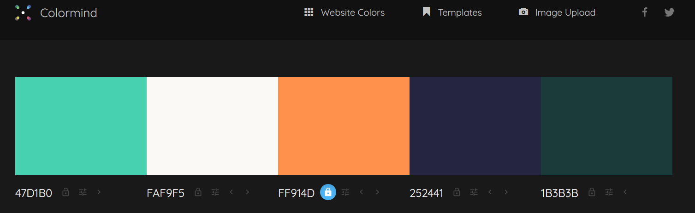

# Newline Alebrije

[View the live project here]()

## Table of contents
***
1. [Introduction](#Introduction)
2. [UX](#UX)
    1. [Ideal User Demographic](#Ideal-User-Demographic)
    2. [User Goals](#User-Goals) 
    3. [Development Planes](#Development-Planes)
3. [Features](#features)  
    1. [Used Features](#Used-Features)
    2. [Common Features](#Common-Features)
    3. [Existing Features](#Existing-Features)
    2. [Future features](#Future-Features)
4. [Design](#Design)
    1. [ Color Palette](#Color-Palette)
    2. [ Typography](#Typography)
    3. [Visuals](#Visuals)
## Introduction
This is a website set in a fantasy world, where exists the **alebrije**, an animal found in the world of death, that is a spiritual guide. Is a website of a company that can match you with an alebrije from the other world and sends it to your house or a specific location.

On this website, you are going to get information about the alebrije, the company, and what you have to do to get your spiritual guide.

This website was made for the first of five Milestone projects required to complete the Diploma in Software development (eCommerce Applications) program at The Code Institute. 

The main requirements of this project are to use all the technologies learned so far, **HTML5** and **CSS3**. 
Data is presented to help users achieve their goals, e.g. learning about a product/service in which they are interested. The presentation of this data advances the site owner's goals, e.g. helps them market a product/service.

- In this case, the goal of the user is to know more about alebrijes and getting one by completing a form.
- The goal of the company is to get the user to complete the form so they can give as much alebrijes as users that fill out the form. Give more information to previous user about alebrije, about the company and contact details in case user needs help.

## UX
### Ideal User Demographic
The ideal user for this website is:
* New user
* Current user
* Student-Curious outsider 

### User Goals
#### New User Goals
This website is for people that would like to receive an alebrije.
1. As a new user i would like to access the main page  and all the sections or links that brings me to the specific piece of information I am looking for.
2. As a new user i would like to know what this company offer.
3. As a new user i would like to see detailed information about alebrijes and the steps to get it.

#### Current User Goals
This website is for people who want to contact us for any proplems or any information regarding their alebrije.
1. As a current user i would like to access any contact information and social media easily.
2. As a current user i would like to see more information about the story of the company out of curiosity.
3. As a current user i would like to check the info about the alebrijes.

#### Student-Curious outsider Goals
This website is for people who would like to know more about the alebrije, about our company or is just seeking information about alebrijes.
1. As a Student/Curious outsider i would like to see any information about the alebrijes and the company.
2. As a Student/Curious outsider i would like to see all the main information in the homepage, and have easy links to access more detailed information.

## Development-Planes
To create a comprehensive website based on the user and company goals.
It is set in a fantasy world, where this company can provide a product from the underworld.

It has a background story in the about us page on how and who created this company in this fictional world. It explains the steps to get the product and as well in details the difference between the different kind of product you could get.

### Strategy
Used to determine business goals and user needs.

Business goals:
- Get the user to fill out the form to match with the alebrije.
- Give information about the product (Alebrije).
- Give information about the step that the user has to do to get the product.
- Give information about the company.
- Give the user contact details.

User needs were determined based on different target audiences: 

- **Roles:**
    - Current users
    - New users
    - Student/Curious outsider

- **Demographic:**
    - Minimum 18 years old
    - From all over the world

- **Psychographic:**
    - Lifestyles:
        - Interested in Animals
        - Spiritual
    - Personality/Attitudes:
        - Problematic
        - Alone
        - Lost
        - Need of a spiritual guide

With the information above the strategy plan gave the following result. 

Strategy Plane - Viability/Feasibility Table

### Scope

The scope plane, based on the goals established on the strategy plane, identified the following two categories.
- Content Requirements:
    - The user will be looking for:
        - Information on the alebrije
        - Detailed information on the 4 kinds of alebrije
        - Steps to follow in order to get the alebrije
            1. Just on the 2nd of november
            2. Make an altar to connect with the other world
            3. Prepare 2 dishes
- Functionality Requirements:
    - The user will be able to:
        - Be able to easily navigate the site to find the information they require.
        - Be able to fill out the form to match with their unique alebrije.

### Structure

The structure was then created with a site map for easy and intuitive navigation.
From left to right from the most basic information :
- The homepage 
- What is an alebrije
- The steps you need to follow to get one 
- The form to actually get one
- About us page and the information about company, founder, contact details

Structure Plane - Site-Map

### Skeleton

Wireframes were made to organize and make the skeleton of the website. The wireframes were created using a desktop version of Balsamiq.

Skeleton Plane - Balsamiq-Wireframes

## Features

### Used Features
- Header = The header is composed by the name of the company and a logo( that is a mix between a horse and a bird like an        alebrije) to give identity to company throughout all the pages.
- Navigation links = Navigation links are at the top of every page, to help the user to go to a different or specific page, and for easy navigation.
- Buttons and links =  They are used to go to a specific section within the same page or in a specific section on a different page to facilitate the user to find the section that he is interested in easily.
- Images and videos = They are used to give the user visive stimulation. Or another option to follow the steps or the information without reading through everything. 
Used embed youtube videos to explain a few more steps to follow.
- Embed map = Used an iframe from google map for the location of the pick up point for the alebrije.
- Social media = Used social media icon on a non-static footer to give the possibility on the user to follow us in instagram , facebook, youtube and the gitgub developer account, with related content about alebrijes and purchase of alebrije's in real life. - Icons = The icons were chosen from the free [Fontawesome](https://fontawesome.com/search?o=r&m=free) website representing the different social media.
- Contacts info = Used to give the user the possibility to contact for any information or alebrijes releted problems.
- Congratulation page = To let know the user that the form was submitted correctly and to tkank the user.
- 404 page = To let know the user that there was an error. Give the user a very small background story that they are in the wrong place, and a button to go to the homepage.
- 500 page = Same of the 404 error page.

### Common Features
- All pages header is at the top of the page, is static and is composed by:
    1. Logo (Made with canva)
    2. Name of company (Searched based on alebrije in [Businessnamegenerator](https://businessnamegenerator.com/))
    3. Navigation links to other pages (At the top of the page)
    4. The first three pages are composed by a text-image section. The image that occupy 2/3 of the width of the page, and a text section that occupy 1/3 of the page. The image and text change from right to left from one section to another to give movement to the page.
    5.  The first 4 pages has a button rapresented by an arrow that point on the right at the bottom of the page, just before the footer that brings the user to the next page without having to scroll up and find the navigation links to go to the next page.
    6. A four column section with a main title , that is needed to go to a different page or another section on the same page. It can be with images to get the user attention or just with a brief explanation of the specific section.
    7. All footer pages are composed by:
    -  Icons that links to social media
    -  Non-static line with height of 55px and 100% width with background color: #ff914d and opacity of 0.9 .

### Existing Features
#### Screen bigger than ... 
Each page of the website is responsive and easy to navigate. Below you will find the deteiled information on the structure and content of the page.
<dl>
    <dt><a href="index.html" target="_blank" alt="Newline Alebrije Home Page">Home Page</a></dt>
    <dd>
    The content of this page are images and text. In summary links to go to different pages, to bring the user to fill out the form in the form.page or t know more about the company, it has a few reviews from previous company to get straight away the trust of the user.
     
    The homepage is divided in <strong>8</strong> different sections:
      <ol>
            <li> This section is the header.
            </li>
            <li> This section is the text-image section. The text section has a small text part on the right of the page and a button to bring him directly in the form page that is the main goal of the website.
            </li>
            <li> This section is a four column section with the main title to explain the different steps to complete to get your alebrije, and a link to the specific section in a different page.
            </li>
            <li>This section is the same as the second section but with the text on the left of the page.
            </li>
            <li>This section is a central section with just text and info, occupy 80% of the page .
            </li>
            <li>This section is the same as the second section but the button brings you to the about us page.
            </li>
            <li>This section is like the third section but with reviews from costumers that already tried our product. Plus a button to go to the next page without going again on the top of the page.
            </li>
            <li>This section is the footer.
            </li>
      </ol>
    </dd>
</dl>  
<dl>  
    <dt><a href="alebrije.html" target="_blank" alt="Newline Alebrije Alebrije page">Alebrije Page</a></dt>
    <dd>
    The content of this page are images and text. To give information to the user about what is an alebrije and the difference between the <strong>4 types of alebrijes.</strong>
     
    The Alebrije page is divided in <strong>10</strong> different sections:
        <ol>
            <li> This section is the header.
            </li>
            <li> This section is a text-image section with the image on the right and the text and the left. It introduce the user to the alebrije.
            </li>
            <li> This section is a central section with just text and info about the alebrije and the different types of alebrijes.
            </li>
            <li>This section is a four column section with the different kind of alebrijes and the link for the specific section on the same page.
            </li>
            <li>This section is a text-image section but is 2/3 text on the right, with a border to divide the 2 parts, and 1/3 image on the left, representing 1 of 4 kind of alebrijes, their pro and cons .
            </li>
            <li> This section is like the one above just inverting the text side on the right and the image on the left.
            </li>
            <li> This section is like the fifth section.
            </li>
            <li> This section is like the sixth section.
            </li>
            <li> This section is the footer and just above the botton to go to the next page.
            </li>
        </ol>    
    </dd>
</dl>    
<dl>
    <dt><a href="steps.html" target="_blank" alt="Newline Steps page">Steps Page</a></dt>
    <dd>
    The content of this page are images, text and videos embeded from youtube. To give information to the user about the <strong>steps</strong>that he will have to do in order <strong>to get the alebrije.</strong>
    The user will have to complete different steps:
    - Wait for the 2nd of November because just on that day the bridge from the underworld open.
    - Make an altar to make the connection with the other world with few different element on it.
    - Prepare 2 dishes: "Pan de Muerto" and the favorite dish of the user.
     
    This is the biggest page and the one with more information .
     
    The Steps page is divided in <strong>7</strong> different sections and <strong>8</strong> sub-sections:
       <ol>
           <li> This section is the header.
           </li>
           <li> This section is the text-image section. The text section has a small text part on the right part of the page and a button to bring him directly in the steps section just below.
           </li>
           <li> This section is a 4 column section where you have a main title and different steps to complete. With also the link to go to the specific section in the same page and in different page.
           </li>
           <li> This is a 3 column section divided in 2 pictures on the right and left of a central text. That explain the first step to complete.
           </li>
           <li> This is a section with an intro and text that explain the introduction of the second step to complete, followed by a video that actually explai the step if you do not want to read the instructions below.
              <ul>
              Those are sub-sections of the second step:
                  <li> This sub-section is made up of a sub-title and a text, and explain the first step to follow.
                  </li>
                  <li> This section is like the first one but with an image as well that is surrounded by text and explain the next step.
                  </li>
                  <li> This section is like the one above.
                  </li>
                  <li> This section is like the one above.
                  </li>
                  <li> This section is like the first section , just with text and without the image.
                  </li>
              </ul>
           </li> 
           <li>This section is again made of a title , text ,a sub-title a text and a video like the first section of the second step. It explain the third step to follow.
                <ul>
                   <li>The first section is a list of ingredients and a picture inside a fieldset
                   </li>
                   <li> This section is like the one abobe but instead of ingredients with instruction for the base, and without the image.
                   </li>
                   <li> This is like the first sub-section of ingredients , but with more instructions.</li>
                </ul>
           </li>
           <li>This section is the footer and just above the botton to go to the next page.
           </li>
       </ol>
    </dd>
</dl> 
<dl>
    <dt><a href="form.html" target="_blank" alt="Newline Form page">Form Page</a></dt>
    <dd>
    The content of this page are images, text, external links and a <strong>form</strong>to complete. To get the information from the user so that he can match with the <strong>Alebrije</strong>. It has a s well 2 diffrent external links if the user wants more information about the alebrije football team and astrological element.
     
    The About-Us page is divided in <strong>5</strong> different sections:
    <ol>
           <li> This section is the header.
           </li>
           <li> This section is a form with text-input, radio, checkbox and a button that accept terms and condition , one that submit the form and another to reset the form.
           </li>
           <li>This section is a form with terms and condition.
           </li>
           <li>This section is an aside section that is or between the 2 froms under 600px or on the right side of the first form for screen larger than 600px.
           </li>
           <li> This section is the footer.
           </li>
    </dd>       
</dl>    
<dl>
    <dt><a href="about-us.html" target="_blank" alt="Newline About-Us page">About-Us Page</a></dt>
    <dd>
    The content of this page are images, text and an embeded map from google map. To give information to the user about the <strong>company</strong>, <strong>the founder</strong> and the <strong>location.</strong>
     
    The About-Us page is divided in <strong>5</strong> different sections:
    <ol>
           <li> This section is the header.
           </li>
           <li> This section is just an image occupying 100% width of the screen , representing the company in the other world.
           </li>
           <li>This section is just a text and a small image (of the founder )surrounded by text, that describes the origin of the company and the story about the founder.
           </li>
           <li>This section is a 2 column section where it says how the user can contact the company and on the right side a map with the location to where go and get your alebrije.
           </li>
           <li> This section is the footer.
           </li>
    </dd>       
</dl>    

### Future Features
- Implementing in the step section some javascript code to hide some of the content for the steps page, so that the user can interact with the page and decide to see more info or not.
- Contact form in the About-Us page.

## Design
### Color Palette
The main colors for the website were chosen with [Colourmind](http://colormind.io/template/material-dashboard/) palette generator.

Colour Palette

The main color is #ff914d named bright orange and is complemented by #252441 named royal curtsy that is a dark shade of blue-magenta.

Those two color were chosen based on the Day Of The Death.

The main colors infact of that day are orange/purple/black .

 I choose the orange as the main color because I wanted to represent that day and at the same time because is the color that more represent mexico and <em>"The day of the death".</em>

 The 2nd of November is celebrated all over the world but especially in Mexico.

The last color used was a darker white the #FAF9F5 used for the background of all the pages and the contrast on the dark theme .

### Typography
The typography was chosen with google fonts.

The two main fonts are :
-  'Arapey'
- 'Work Sans'

That go back to safe fonts as :

- 'Serif'
- 'Sans-serif'

If the page or the browser are not compatible with the first two then it will change for "Serif" and "Sans-serif".

### Visuals
For the visual stimulation of the user is used different images and videos.
Tere are different types of images used throughout the site as:

1. [Artistic images](#Artistic-Images)
2. [Real images](#Real-Images)
3. [Youtube videos](#Youtube-Videos)

#### Artistic images
Artistic images throughout the site were token from [Art Station](https://www.artstation.com/search?sort_by=relevance&query=alebrije), they were selected for the alebrije's and for the positiob of the company in the underworld.

The following images were token from :
- [Jolanda Van Zandbergen](https://www.artstation.com/artwork/WmBmGy) = Used for the "Earth Alebrije".
- [Emylie Boivin](https://www.artstation.com/artwork/lVNwWV) = Used for the "Fire Alebrije".
- [Hadas Gold](https://www.artstation.com/artwork/ybNBbJ) = Used for the "Air Alebrije".
- [Kadjugan](https://www.artstation.com/artwork/6aoZP6) = Used for "Water Alebrije".

- [Daniela Henríquez](https://www.artstation.com/artwork/qQJQQL) = Used for the "Homepage first image".
- [Fogwind](https://www.artstation.com/artwork/ykrVy5) = Used for the "Are you lost section".
- [Leon Tukker](https://www.artstation.com/artwork/nkqro) = Used for the "Company location". 
- [Quentin Laville](https://www.artstation.com/artwork/A9yzZ5) = Used for the "form page left picture".
- [Juan D. Campos](https://www.artstation.com/artwork/lVPQYa) = Used for the "form page right picture".
- [Marlyn](https://www.artstation.com/artwork/14LrRL) = Used for "congratulation message".

#### Real Images
The other images were used to rapresent real scenarios or objects.

 As for example candles, pan de muerto, celebration od the day of the death. And they were token from [Pixabay](https://pixabay.com/es/photos/search/?manual_search=1) , [Unsplash](https://unsplash.com/) and the movie "Coco" for the about us section in the homepage.

 #### Youtube videos
 Youtube videos were used mainly to help the user with the steps to complete.

 They are both in the steps page and help the user to:
 1. To prepare the <em>altar </em>for the arrival of the alebrije.
 2. To cook and prepare the <em>Pan De Muerto</em>.

