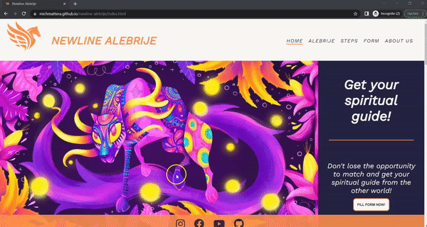

# NEWLINE ALEBRIJE TESTING  

[Read Me file](/README.md)

[View Github repository](https://github.com/michmattera/newline-alebrije)

[View the live project here](https://michmattera.github.io/newline-alebrije/)

## Table of contents
***
1. [Browser Testing](#Browser-Testing)
2. [Manual Testing](#Manual-Testing)
    1. [Navigation Links](#Navigation-Links)
    2. [Specific section button](#Specific-Section-Button)
    3. [Social-Media](#Social-media)
3. [Code validator](#Code-Validator)
4. [User testing](#User-testing)

## Browser Testing

The following browsers have been tested:

- Google Chrome:

     

- Microsoft Edge:

     

- Safari:

     

- Firefox:

     

-Opera:

     

## Manual Testing

### Navigation links

- Clicking on the Navigation Bar's links will bring the user to the specified page.
- Hovering on the navigation Bar's links will bring an underline hover effect for better UX experience.

     

### Specific section button

Tested each navigation button on every page.

1. Main page:
    - Button to go from index.html to form.html.

     

    - Steps in index.html hover effect that invert the color of the background and the text.

    

    - First step in index.html button to go to specific section in steps.html.

    

    - Second step in index.html button to go to specific section in steps.html.
    
    

    - Third step in index.html button to go to specific section in steps.html.

    

    - Fourth step in index.html button to go to specific section in steps.html.

    

    - Second button in index.html that goes to alebrije.html.

    
    
    - Third button in index.html that goes to about-us.html.

    

    - Arrow to go to next page: from index.html to alebrije.html.

    

2. Alebrije page:
    - First button in alebrije.html that goes to the first section of the alebrije explanation.

     

     - Steps in the alebrije page that bring to a specific section on the same page for the four kinds of alebrijes.

          1. Water alebrije:

          

          2. Fire alebrije:

          

          3. Earth alebrije:

          

          4. Air alebrije:

          

    - Arrow to go to next page: from alebrije.html to steps.html.

    

3. Steps page:
    - First button in steps.html that goes to the first section of the alebrije explanation.

     

     - Steps in the steps page that bring to a specific section on the same page, and in a spacific section in the about-us.html.

          1. First step:

           

          2. Second step:

          

          3. Third step:

          

          4. Fourth step:

          

     
    - Arrow to go to next page: from steps.html to form.html.

    

    
4. Form page:
    - External links:

           1. First external link that opens in a new page.

           

           2. Second external link that opens in a new page.

           

     - Trying to submit the form without completing it correctly.

     

     - After completing the form, getting the congratulation message.

     

     - Sidebar of terms and condition.

     

5. About-Us page:
    - Contact section

          1.  Phone-number

          

          2. Email

          

          3. Map

          

### Social Media

Tested social media links that open in a new page.

1. Instagram:

     

2. Facebook:

     

3. Youtube:

     

4. GitHub:

     

          

